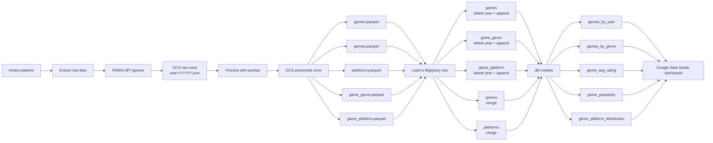
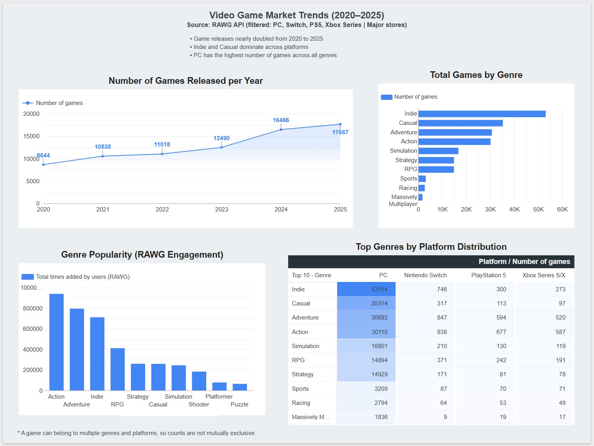

# :video_game: Video Games Data Pipeline (RAWG API)


## Overview

This project analyzes video game market trends between 2020 and 2025 using data from the RAWG API, focusing on major platforms (PC, Nintendo Switch, PlayStation 5, and Xbox Series) and leading digital stores.

The pipeline extracts, processes, and models video game data to explore how the volume and distribution of games have evolved over time. It aims to answer key questions such as:

- How has the number of game releases changed year over year?
- Which genres have the highest number of games?
- Which genres generate the most user engagement?
- How are genres distributed across major gaming platforms?

The results show a strong growth in game releases over the analyzed period, with Indie and Casual genres consistently leading in volume across platforms. Additionally, PC stands out as the platform with the highest number of games across all genres.

Overall, the project demonstrates how a modern data pipeline can be used to transform raw API data into structured insights through cloud storage, data warehousing, transformation layers, and visualization tools.


## Architecture



## Dashboard

The final results are presented in a Data Studio dashboard built on top of the dbt marts generated in BigQuery.

The dashboard is intended to make the main analytical questions easy to explore, including:

- release trends by year
- genre distribution across the catalog
- popularity patterns by genre
- genre presence by platform

Key insights from the dashboard:

- Game releases nearly doubled between 2020 and 2025
- Indie and Casual genres dominate the catalog across platforms
- PC has the highest number of games across all genres

[View the dashboard in Data Studio](https://datastudio.google.com/reporting/481338fd-5553-41f8-92a9-25bf38ff84ef/page/yABvF)




## Limitations

- RAWG is not an official source of record, and its coverage may be incomplete or biased.
- The `added` metric is used as a proxy for popularity, but it does not represent actual sales or active players.
- Games can belong to multiple genres and platforms, so aggregations are not mutually exclusive.
- The dataset is filtered to major platforms and stores, which limits global coverage.


## Tech Stack

- **Infrastructure**: Terraform
- **Containerization**: Docker
- **Orchestration**: Kestra
- **Data Lake**: Google Cloud Storage (GCS)
- **Data Warehouse**: BigQuery
- **Transformations**: dbt
- **Language**: Python


## Stage-by-Stage Breakdown

### 1. Extract

Kestra launches the extraction flow for a selected year. The extractor calls the RAWG API using a date range from `YYYY-01-01` to `YYYY-12-31`, paginates through the results, and uploads each response page as a JSON file into the GCS raw zone.

Output example:

```text
gs://<bucket>/<raw_prefix>/year=2024/rawg_games_20240101_20241231_001.json
```

### 2. Process

The processing step reads all raw JSON files for a given year from GCS and combines the `results` arrays into a single in-memory collection. It then produces five structured datasets:

- `games`
- `genres`
- `platforms`
- `game_genre`
- `game_platform`

These datasets are validated for emptiness and key duplication, then written as Parquet files into the processed zone in GCS.

Output example:

```text
gs://<bucket>/<processed_prefix>/year=2024/games.parquet
```

### 3. Load

The load step moves processed Parquet files from GCS into BigQuery raw tables.

- Fact and bridge tables are reloaded per year:
  - `games`
  - `game_genre`
  - `game_platform`
- Dimension tables are upserted through temporary tables and `MERGE`:
  - `genres`
  - `platforms`

This design makes yearly reloads possible without duplicating fact records, while keeping dimensions consolidated across years.

### 4. Transform with dbt

dbt uses the BigQuery raw dataset as its source layer and builds:

- `staging` models as views
- `marts` models as tables

Current marts included in the project:

- `games_by_year`
- `games_by_genre`
- `genre_avg_rating`
- `genre_popularity`
- `genre_platform_distribution`

Partitioning and clustering have been applied for educational purposes. Due to the small size of the data marts, their impact on performance is negligible.


## Orchestration

Kestra is the orchestrator for the end-to-end flow. The main pipeline runs these subflows in sequence:

1. `rawg_extract`
2. `rawg_process`
3. `rawg_load`
4. `rawg_dbt`

That gives the repository a clear execution path:

```text
RAWG API
  -> GCS raw JSON
  -> pandas processing
  -> GCS processed Parquet
  -> BigQuery raw
  -> dbt staging
  -> dbt marts
```

## Repository Layout

```text
.
├── kestra/
│   └── flows/          # Kestra workflows for extract, process, load, and dbt
├── src/
│   ├── extract/        # RAWG API extraction and raw GCS reads
│   ├── process/        # Processing entrypoint
│   ├── transform/      # Tabular transformations
│   └── load/           # BigQuery load logic
├── dbt/
│   └── rawg_dbt/       # dbt staging and marts project
├── terraform/          # Infrastructure as code for cloud resources
├── Dockerfile          # Runtime image for pipeline tasks
├── docker-compose.yml  # Local Kestra stack
├── pyproject.toml      # Python project configuration
├── uv.lock             # Locked Python dependencies
├── .env.example        # Required environment variables
├── LICENSE
└── README.md
```

## Design Decisions and Trade-offs

This project was designed to demonstrate a complete modern data workflow with a strong focus on clarity, modularity, and end-to-end integration.

Main design choices:

- Use Kestra as the orchestrator to separate extraction, processing, loading, and analytics into independent subflows.
- Use GCS as an intermediate storage layer for both raw JSON files and processed Parquet files.
- Use BigQuery as the warehouse layer for structured raw data and dbt-ready sources.
- Use dbt to keep the analytical layer declarative, testable, and easy to extend.

Trade-offs taken for this project:

- The pipeline prioritizes readability and simplicity over full production-grade reproducibility.
- Raw files are partitioned by year, which makes the dataset easy to inspect and debug.
- If the same year is reprocessed with a different `max_pages`, older raw files may still remain in GCS unless they are explicitly cleaned first.
- For an academic project, this trade-off keeps the implementation straightforward while still demonstrating the full ETL and ELT lifecycle.

Why this approach is valid:

- It shows integration with a real external API.
- It includes cloud storage and warehouse layers.
- It separates operational processing from analytical modeling.
- It reflects a realistic modern data stack using Kestra, GCS, BigQuery, and dbt.

Possible future improvements:

- Version raw data by execution instead of only by year.
- Add stronger data quality checks before loading into BigQuery.
- Propagate more runtime parameters through the main Kestra flow.
- Extend the Terraform setup to cover more of the infrastructure lifecycle.

## Notes

- The pipeline is structured like a layered analytics workflow: raw ingestion, processed storage, warehouse loading, and semantic modeling.
- Storage boundaries are explicit: GCS is used for raw and processed files, while BigQuery is used for warehouse and analytics layers.
- The repo already has a clean separation of concerns by execution stage, which makes it easy to extend with more sources, more marts, or additional validations.


## How to Run

### Prerequisites

Before running the project, make sure you have:

- A RAWG API key with access to the `/games` endpoint
- A Google Cloud project
- A Google Cloud service account key with permissions for GCS and BigQuery
- Docker and Docker Compose
- Terraform installed locally

Recommended setup details:

- Create a local `credentials/` folder and place the GCP service account JSON key there
- Use the same key path consistently in `.env` and in the mounted `credentials/` directory used by Kestra
- Review `terraform/terraform.tfvars` before applying infrastructure, especially project, region, bucket, and dataset names

If you want to run the Python code outside Docker for local development, you will also need Python `3.11+`.

### 1. Configure environment variables

Create a local environment file:

```bash
cp .env.example .env
```

Then fill in the variables defined in `.env.example`.

The most important ones are:

- `RAWG_API_KEY`
- `GOOGLE_APPLICATION_CREDENTIALS`
- `GCP_PROJECT_ID`
- `GCS_BUCKET`
- `GCS_RAW_PREFIX`
- `GCS_PROCESSED_PREFIX`
- `BQ_LOCATION`
- `BQ_DATASET_RAW_PREFIX`
- `BQ_DATASET_STAGING_PREFIX`
- `BQ_DATASET_MARTS_PREFIX`

If you run Kestra locally, also configure the Kestra and Postgres variables included in the same file.

Make sure the service account key referenced by `GOOGLE_APPLICATION_CREDENTIALS` is also available inside the local `credentials/` folder, because the Kestra task runners mount that directory into the containers.

### 2. Provision GCP resources with Terraform

Before running the pipeline, create the storage and warehouse resources:

```bash
cd terraform
terraform init
terraform apply
```

This repository currently manages:

- the GCS bucket used for raw and processed data
- the BigQuery datasets used for raw, staging, and marts layers

### 3. Build the runtime image

The extract, process, and load flows use the local Docker image `rawg-pipeline:latest`:

```bash
docker build -t rawg-pipeline:latest .
```

### 4. Start Kestra locally

```bash
docker compose up
```

Kestra UI:

```text
http://localhost:8080
```

### 5. Load flows and dbt project into Kestra

Create or use the `video_games` namespace in Kestra and load:

- the flow files from `kestra/flows/`
- the dbt project from `dbt/rawg_dbt/` as namespace files, keeping the path `dbt/rawg_dbt/...`

This step is required because the `rawg_dbt` flow enables `namespaceFiles` and runs dbt with:

```text
projectDir: dbt/rawg_dbt
```

So the dbt project must exist inside the Kestra namespace file tree, not only in the Git repository.

### 6. Run the main pipeline

Execute the Kestra flow:

```text
rawg_pipeline
```

Main inputs:

- `year`: required, selectable from `2020` to `2025`
- `max_pages`: optional, useful for limiting extraction volume during tests
