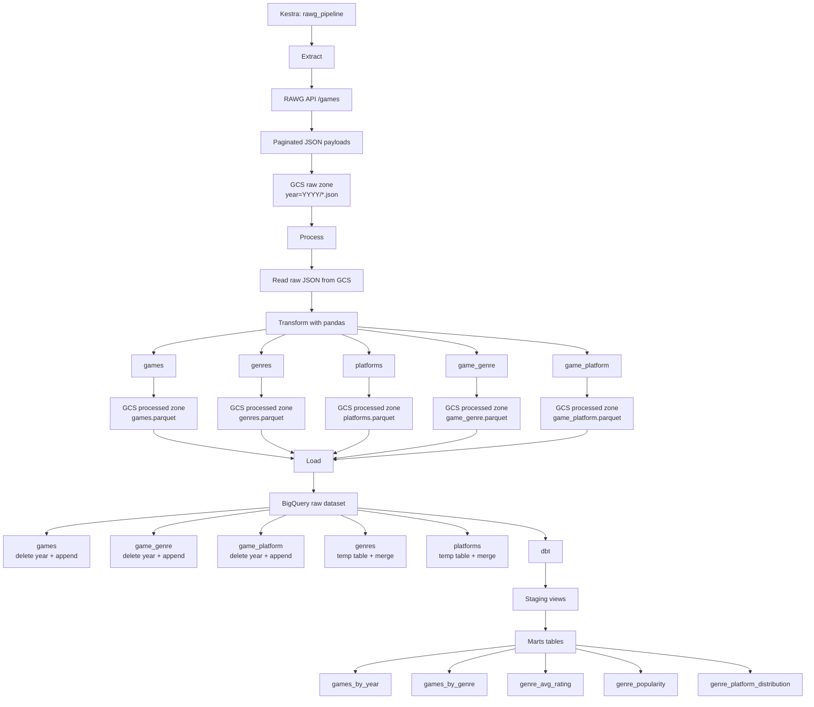

# Video Games Data Pipeline

End-to-end data pipeline that ingests video game data from the RAWG API, stores the raw payloads in Google Cloud Storage, transforms them into analytical tables, loads them into BigQuery, and builds reporting-ready marts with dbt.

## Architecture Overview

This repository is organized around four main stages:

- `Extract`: requests game data from the RAWG API and stores paginated JSON files in GCS.
- `Process`: reads the raw JSON files, normalizes them into tabular datasets with pandas, and writes Parquet files back to GCS.
- `Load`: loads the processed Parquet files into BigQuery raw tables.
- `Transform`: runs dbt models on top of the raw tables to build staging views and marts for analysis.

## Pipeline Flow



## Stage-by-Stage Breakdown

### 1. Extract

Kestra launches the extraction flow for a selected year. The extractor calls the RAWG API using a date range from `YYYY-01-01` to `YYYY-12-31`, paginates through the results, and uploads each response page as a JSON file into the GCS raw zone.

Output example:

```text
gs://<bucket>/<raw_prefix>/year=2024/rawg_games_20240101_20241231_001.json
```

### 2. Process

The processing step reads all raw JSON files for a given year from GCS and combines the `results` arrays into a single in-memory collection. It then produces five structured datasets:

- `games`
- `genres`
- `platforms`
- `game_genre`
- `game_platform`

These datasets are validated for emptiness and key duplication, then written as Parquet files into the processed zone in GCS.

Output example:

```text
gs://<bucket>/<processed_prefix>/year=2024/games.parquet
```

### 3. Load

The load step moves processed Parquet files from GCS into BigQuery raw tables.

- Fact and bridge tables are reloaded per year:
  - `games`
  - `game_genre`
  - `game_platform`
- Dimension tables are upserted through temporary tables and `MERGE`:
  - `genres`
  - `platforms`

This design makes yearly reloads possible without duplicating fact records, while keeping dimensions consolidated across years.

### 4. Transform with dbt

dbt uses the BigQuery raw dataset as its source layer and builds:

- `staging` models as views
- `marts` models as tables

Current marts included in the project:

- `games_by_year`
- `games_by_genre`
- `genre_avg_rating`
- `genre_popularity`
- `genre_platform_distribution`

## Orchestration

Kestra is the orchestrator for the end-to-end flow. The main pipeline runs these subflows in sequence:

1. `rawg_extract`
2. `rawg_process`
3. `rawg_load`
4. `rawg_dbt`

That gives the repository a clear execution path:

```text
RAWG API
  -> GCS raw JSON
  -> pandas processing
  -> GCS processed Parquet
  -> BigQuery raw
  -> dbt staging
  -> dbt marts
```

## Repository Layout

```text
.
├── kestra/
│   └── flows/          # Pipeline orchestration
├── src/
│   ├── extract/        # API extraction and raw GCS reads
│   ├── process/        # Processing entrypoint
│   ├── transform/      # Tabular transformations
│   └── load/           # BigQuery load logic
├── dbt/
│   └── rawg_dbt/       # Staging + marts
├── Dockerfile          # Runtime image for pipeline tasks
├── docker-compose.yml  # Local Kestra stack
└── .env.example        # Required environment variables
```

## Design Decisions and Trade-offs

This project was designed to demonstrate a complete modern data workflow with a strong focus on clarity, modularity, and end-to-end integration.

Main design choices:

- Use Kestra as the orchestrator to separate extraction, processing, loading, and analytics into independent subflows.
- Use GCS as an intermediate storage layer for both raw JSON files and processed Parquet files.
- Use BigQuery as the warehouse layer for structured raw data and dbt-ready sources.
- Use dbt to keep the analytical layer declarative, testable, and easy to extend.

Trade-offs taken for this project:

- The pipeline prioritizes readability and simplicity over full production-grade reproducibility.
- Raw files are partitioned by year, which makes the dataset easy to inspect and debug.
- If the same year is reprocessed with a different `max_pages`, older raw files may still remain in GCS unless they are explicitly cleaned first.
- For an academic project, this trade-off keeps the implementation straightforward while still demonstrating the full ETL and ELT lifecycle.

Why this approach is valid:

- It shows integration with a real external API.
- It includes cloud storage and warehouse layers.
- It separates operational processing from analytical modeling.
- It reflects a realistic modern data stack using Kestra, GCS, BigQuery, and dbt.

Possible future improvements:

- Version raw data by execution instead of only by year.
- Add stronger data quality checks before loading into BigQuery.
- Propagate more runtime parameters through the main Kestra flow.
- Extend the Terraform setup to cover more of the infrastructure lifecycle.

## Notes

- The pipeline is structured like a layered analytics workflow: raw ingestion, processed storage, warehouse loading, and semantic modeling.
- Storage boundaries are explicit: GCS is used for raw and processed files, while BigQuery is used for warehouse and analytics layers.
- The repo already has a clean separation of concerns by execution stage, which makes it easy to extend with more sources, more marts, or additional validations.
